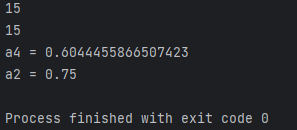

# lab07  

## Задание
    1. Напишите две функции для решения задач своего варианта - с использованием рекурсии и без.
    2. Оформите отчёт в README.md. Отчёт должен содержать:
        Условия задач
        Описание проделанной работы
        Скриншоты результатов
        Ссылки на используемые материалы
## Проделанная работа

Написал код по первому заданию своего варианта (`2`) используя и не используя рекурсию. То же самое сделал для второго задания.

## Скриншоты

## Список использованных источников

[лаба](https://evil-teacher.on.fleek.co/prog_pm/lab07/)
